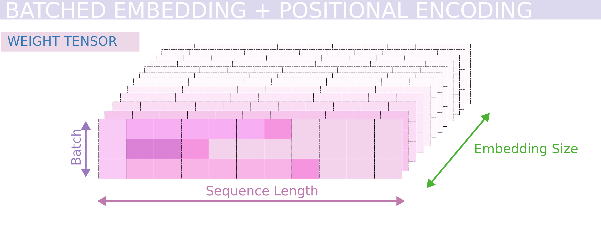
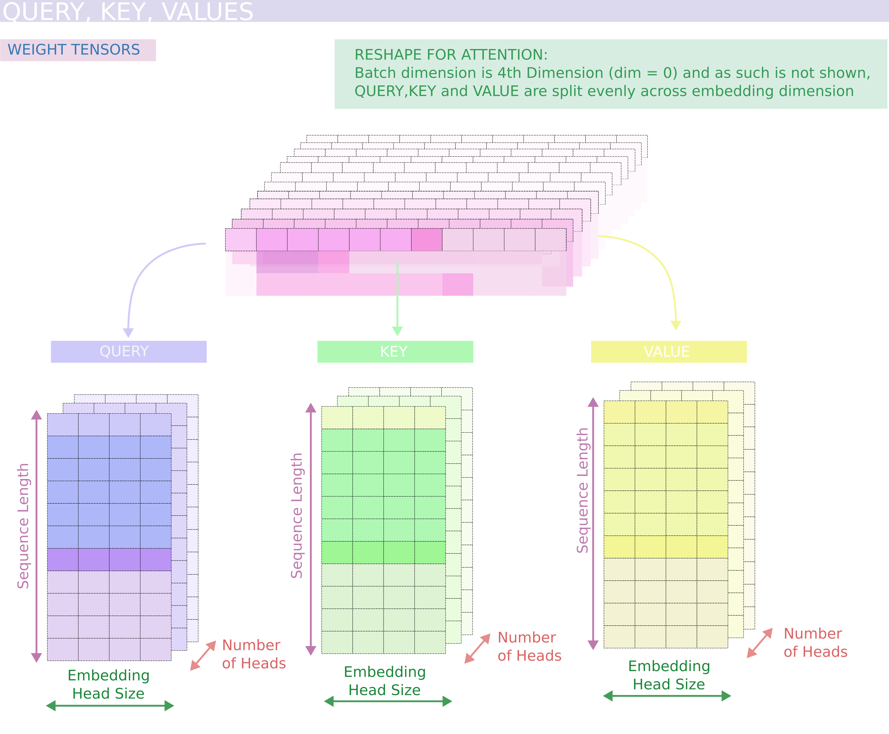
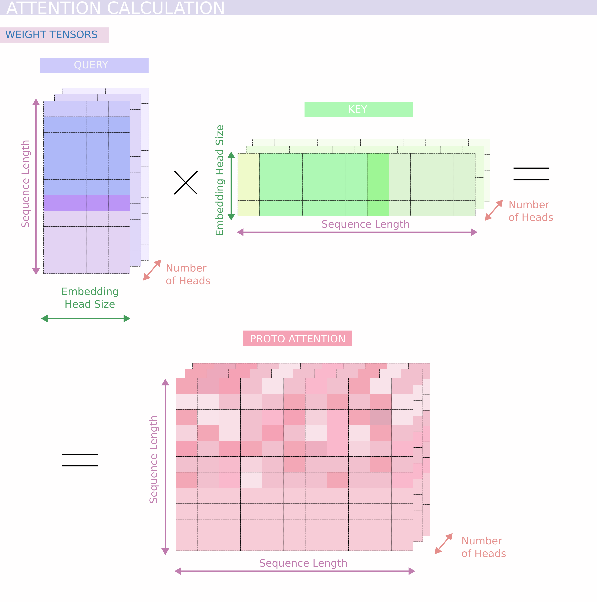
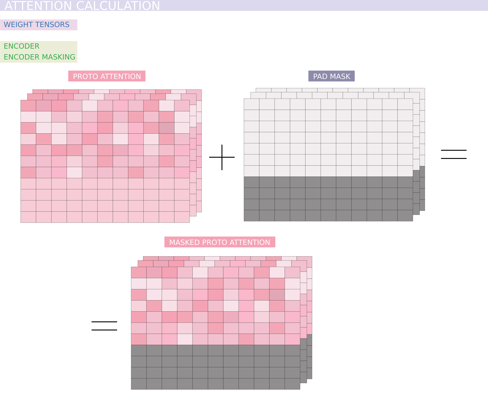
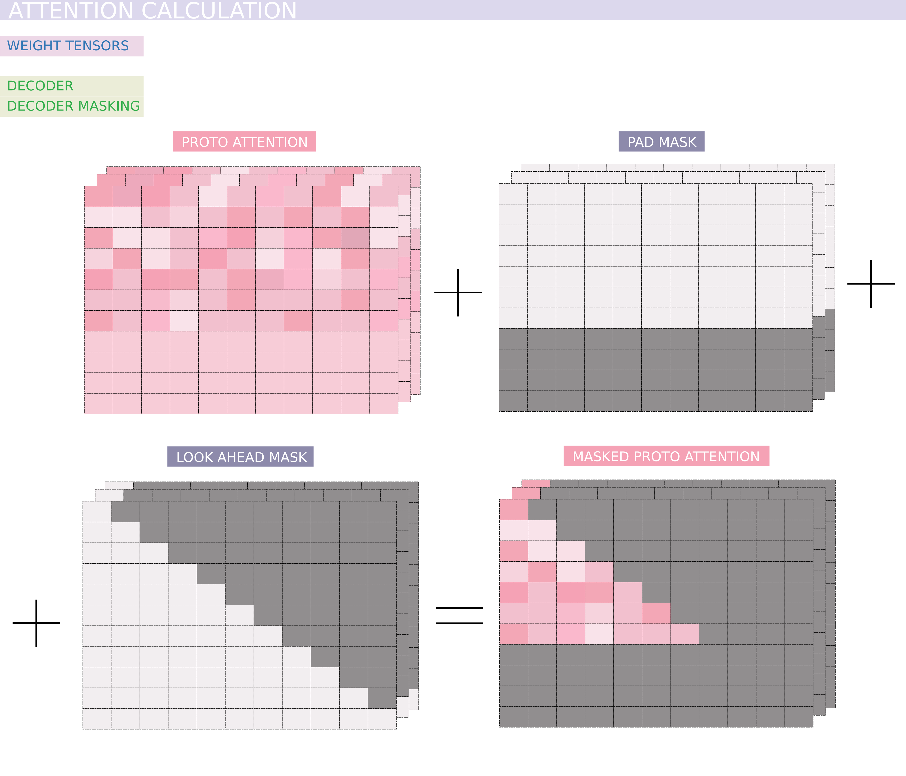
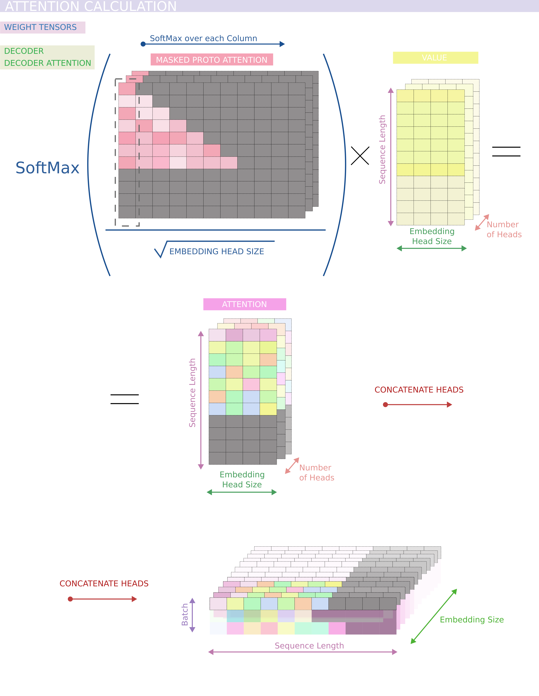

# from_scratch_Transformer_Neural_Network_Adaptable_to_GPT_or_BERT_English_to_Croatian_Translator
Using Pytorch I create from scratch a full Transformer model (with separate encoder, and decoder blocks that can then be stacked) as shown in the original [Transformer paper](https://arxiv.org/abs/1706.03762). This architecture can be easily then implemented to act as GPT or BERT.  
I here trained a full Transformer network to act as a translator from English to Croatian. Inside the EnglishCroatianDatabse is a database I created that has an English-to-Croatian pair of translated sentences, I created 1049773 such pairs and used them for my training but if needed anybody can use this database for their needs. These pairs are all low caps without punctuation  
There are several scripts in the script directory, the embedding script provides embedding and Positional Encoding classes, the transformerScript has the classes that define the encoder and decoder blocks and also the construction of the whole model using the embeddings class, train script does the training with a token by token generation for validation, the dataset creation script creates  from pandas data frame an object containing all needed inputs to the data loader such as input to the encoder, input to decoder, labels, and tasks tensors ready for batching also this class performs tokenization. 
The modelData directory contains .json tokenization for the English and Croatian sentences respectively and also contains a pre-trained model.  

 
Here I will shortly through images that show the workings of the transformer network and explain the process of the Transformer using the said images, The images are all made by myself and are under a license that allows usage only for noncommercial and educational purposes,
and you are obligated to mention the author if you use them!!!: 

The Transformer Architecture is color-coded by layers, the arrows show data pathways through encoder and decoder blocks:
 

  

 
Firstly the input to the encoder and decoder (in my case of translation) needs to be tokenized, so, for example, let's say you have a list of strings, we use a tokenizer such as Word tokenizer that splits the string by words, we create a vocabulary from all the words we have and then assign the numbers to each word, we also put the [SOS] (start of a sentence) token that will be put at the start of each sentence and [EOS] (end of the sentence) token put at the end of a sentence, we also define a maximum sequence length (usually the largest sentence plus some range) and we put [PAD] tokens to pad up if sentence shorter than the max sequence length. As shown in the next image.
 

  

 
Now we concatenate the tokenized sentences (as shown by colors) into a 2d tensor of batches:
 

  

 
That is how the input to the encoder and decoder looks like, now we will,based on the embedd size of the model, project from vocabulary size into our model size, firstly we will perform the embedding of data and in the case of sentences positional encoding, this projection is what we are learning as indicted that all these tensors, in the end, represent weights, color coding show how the input data is mapped to each weight position in the tensor (simple linear algebra matrix operations):
 

  

 
Now comes the main part of the transformer, mainly the attention mechanism, for the attention mechanism we take one batch (do this batched for all batches but in images shown for one batch) and redistribute equal parts of embedded size tensor to each head, meaning every head sees a part of embedding space, now for each head to perform attention we give it a Query, Key, and Value tensor, initially all the same but the weights of these tensors are also learned. You can look at these Query, Keys, and Values such that Query represents something that I want and I am asking the specific Head for it from its bag of things, Keys being what that specific Head has in its bag of things and value what the Head in the end gives me from its bag:
 
 

  

 
We can start calculating the attention, firstly we matrix multiply the queries and keys, this is the same for the encoder and decoder:
 

  

 
Now based on the encoder or decoder we apply the masks which are also just a tensor that will block out a piece of data, firstly for the encoder as shown we block the positions that correspond to [PAD] tokens, we do this by setting them to zero when creating a mask and then for every zero we give it a float('-inf') as when using softmax this will tend to zero:
 

  

 
Finally, for the encoder, the calculated attention is softmax of proton-attention (divided by the square root of head embedd size) and matrix multiplied by the value tensor. Then we just concatenate (merge) data from each Head back into the starting tensor shape, you can look at this like we asked each Head for something and then took each answer:
 

  

 
For the decoder's attention, we do the same but here we add one more mask (in my case). These masks are something that you can play with and distribute different masks at different stages, but for now, the first mask is the same maks as in the encoder ([PAD] mask) and the second mask is so so-called look-ahead mask that for each token in sentence if you have a sentence of five words that are tokenized, for the first token (first word) we make it such that this word can only see itself, next word sees itself and the word before, etc. this is represented by the lower triangular mask, where the upper right of diagonal part are zeros that we put into float('-inf'):
 
 

  

 
Final attention is calculated the same:
 

  

